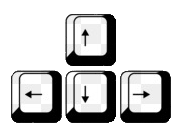

# Scratch projekt
A projektben egy football játékot lehet játszani, amely célja, hogy egy perc alatt minél több pontot szerezz és minél több gólt rúgj az ellenfél kapujába.

## Irányítás
- Player 1:  
  
- Player 2:  
  

## Játékról
- ha a labda az alapvonalra ér pár másodperc gól öröm, majd a játékosok alapállapotba kerülnek
- ha nincs gól és a pályaszélét érinti a labda visszaugrik minden alapállapotra

## Kép

